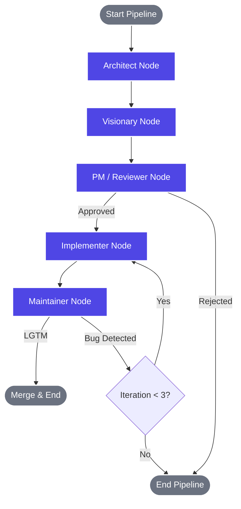

# AutoMaintainer Architecture

AutoMaintainer is built using a modern, reactive stack designed for real-time observability and autonomous multi-agent execution.

## Tech Stack
- **Frontend**: Next.js (React), Tailwind CSS, Framer Motion for UI/UX, and WebSockets for real-time log streaming.
- **Backend**: FastAPI (Python) for API handling and WebSocket management.
- **Agent Orchestration**: LangGraph for stateful agent pipelines.
- **LLM**: Llama 3 via Groq for blazing fast inference.
- **Platform Integration**: `PyGithub` for native GitHub repository interactions (Issues, Commits, PRs).

## The AI Crew (LangGraph Topology)

The core logic of AutoMaintainer relies on a 5-agent engineering team that works sequentially, with a self-correcting iteration loop at the end.

### Agent Roles

1. **Architect (Principal Engineer)**: Scans the target repository's file tree and README. Assesses the tech stack and project state, then generates a strict architectural directive.
2. **Visionary (Brainstormer)**: Reads the directive and ideates a single, innovative feature. It opens a native **GitHub Issue** detailing the proposed feature.
3. **Reviewer (Product Manager)**: Evaluates the feature against the original directive. If approved, it comments on the GitHub Issue. If rejected, it closes the Issue and stops the pipeline.
4. **Implementer (Developer)**: Writes the actual Python code to build the feature. It pushes the code to a new branch and opens a **Pull Request** linked to the Issue. If returning from a rejection loop, it reads the feedback and pushes a new commit to the *existing* branch.
5. **Maintainer (Senior Engineer)**: Reviews the code in the PR. If it spots a flaw, it leaves a comment and routes the pipeline *back* to the Implementer (up to 3 times). If the code is solid, it outputs `LGTM` and automatically merges the Pull Request!
